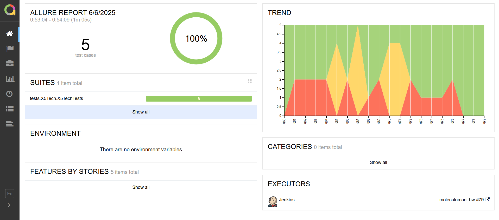
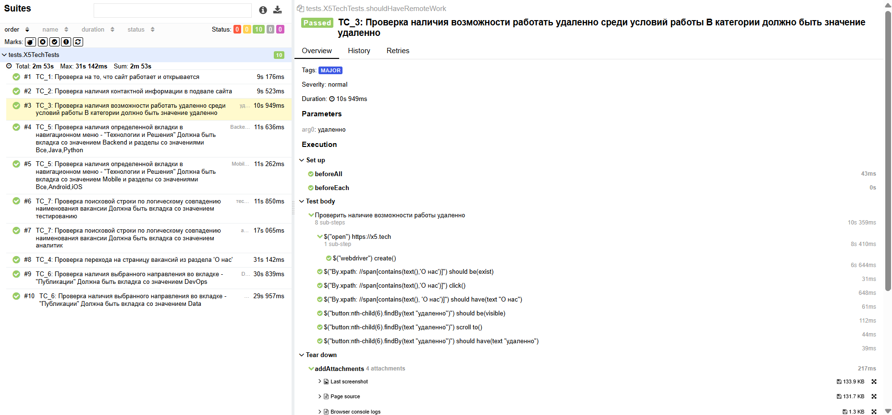
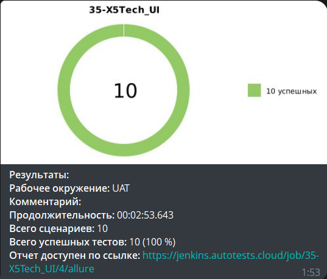
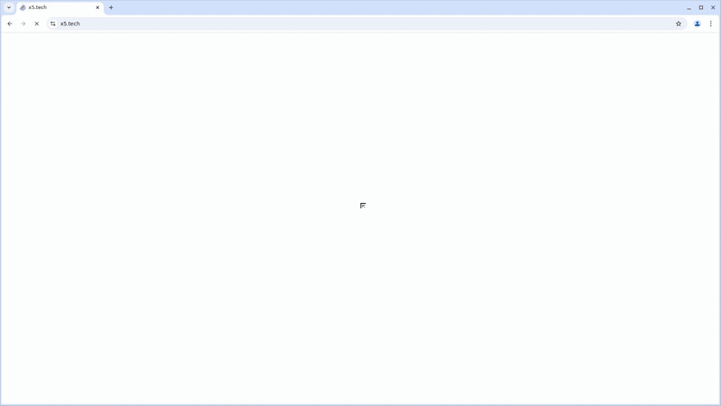

<p align="center">
  <a href="https://x5.tech/" target="_blank">
    
  </a>
</p>

# Проект по автоматизации тестовых сценариев для сайта компании [X5Tech](https://x5.tech/)
## 🔖 Содержание
- [Технологический стек](#-технологический-стек)
- [Особенности проекта](#-особенности-проекта)
- [Web-тесты](#-web-тесты)
- [Параметры запуска тестов](#-параметры-запуска-тестов)
- [Allure-отчет](#-allure-отчет)
- [Уведомления в Telegram](#-уведомления-в-telegram)
- [Видео с запуском тестов в Selenoid](#-видео-с-запуском-тестов-в-selenoid)

## 💻 Технологический стек

<div align="center">
  <table>
    <tr>
      <!-- Первая строка -->
      <td align="center" width="110">
        <a href="https://www.jetbrains.com/idea/" target="_blank">
          
        </a>
        <br>IDEA
      </td>
      <td align="center" width="110">
        <a href="https://www.java.com" target="_blank">
          
        </a>
        <br>Java
      </td>
      <td align="center" width="110">
        <a href="https://junit.org/junit5/" target="_blank">
          
        </a>
        <br>JUnit 5
      </td>
      <td align="center" width="110">
        <a href="https://gradle.org/" target="_blank">
          
        </a>
        <br>Gradle
      </td>
      <td align="center" width="110">
        <a href="https://selenide.org/" target="_blank">
          
        </a>
        <br>Selenide
      </td>
    </tr>
    <tr>
      <!-- Вторая строка -->
      <td align="center" width="110">
        <a href="https://aerokube.com/selenoid/" target="_blank">
          
        </a>
        <br>Selenoid
      </td>
      <td align="center" width="110">
        <a href="https://docs.qameta.io/allure/" target="_blank">
          
        </a>
        <br>Allure
      </td>
      <td align="center" width="110">
        <a href="https://www.jenkins.io/" target="_blank">
          
        </a>
        <br>Jenkins
      </td>
      <td align="center" width="110">
        <a href="https://github.com/" target="_blank">
          
        </a>
        <br>GitHub
      </td>      
      <td align="center" width="110">
        <a href="https://telegram.org/" target="_blank">
          
        </a>
        <br>Telegram
      </td>
    </tr>
  </table>
</div>

- Тесты написаны на **Java** с использованием фреймворка **Selenide** в **IntelliJ IDEA**
- Сборка проекта осуществляется через **Gradle**
- Запуск тестов в контейнерах **Selenoid**
- Интеграция с **Jenkins** + автоматическая отправка отчетов в **Telegram**

---

## ℹ️ Особенности проекта
- [x] Тестовый проект состоит из UI автотестов
- [x] `Fluent Page Object` проектирование UI-тестов
- [x] Различные файлы конфигурации для запуска теста в зависимости от параметров сборки
- [x] Обширная параметризация тестов
- [x] Интеграция с `Allure TestOps`
- [x] Автотесты как тестовая документация

---

## 🌐 Web-тесты

### Основные проверки
- ✅ Проверка общей работоспособности сайта
- ✅ Проверка наличия контактной информации
- ✅ Проверка предложенных условий работы
- ✅ Проверка корректности роутинга между навигационным меню
- ✅ Проверка работоспособности пункта навигационного меню - "Технологии и Решения"
- ✅ Проверка работоспособности пункта навигационного меню - "Публикации"
- ✅ Проверка поисковой строки по логическому совпадению наименования вакансии

---

## 🔑 Параметры запуска тестов

### ⤵️ Локальный запуск
```bash
gradle clean test -Denv=local 
```

### [ Удаленный запуск тестов в Jenkins](https://jenkins.autotests.cloud/job/35-X5Tech_UI/)

```bash
clean
${TASKS}
-Denv=remote
-Dremote.url=${SELENOID_URL}
-Dremote.login=${SELENOID_LOGIN}
-Dremote.password=${SELENOID_PASSWORD}
-Dbrowser=${BROWSER}
-Dbrowser.version=${BROWSER_VERSION}
-Dbrowser.size=${BROWSER_SIZE}
```


## [ Allure-отчет](https://jenkins.autotests.cloud/job/35-X5Tech_UI/allure/)

### Главная страница Allure-отчета


### Пример отчета о выполнении тестов
Содержит в себе:
- Шаги теста
- Скриншот страницы на последнем шаге
- Page Source
- Логи браузерной консоли
- Видео прогона автотестов
  


##  Уведомления в Telegram

### После завершения сборки, бот, созданный в Telegram, автоматически обрабатывает и отправляет сообщение с результатом

<p align="center">

</p>

##  Видео с запуском тестов в Selenoid
К каждому тесту в отчете прилагается видео прогона.
<p align="center">
  
</p>
<hr></hr>
<p align="center">
  
</p>
